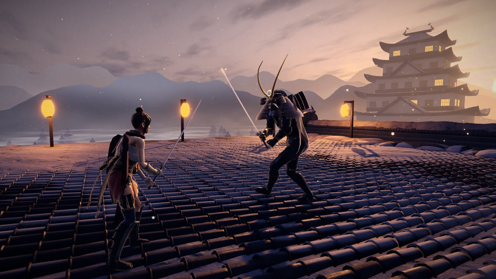
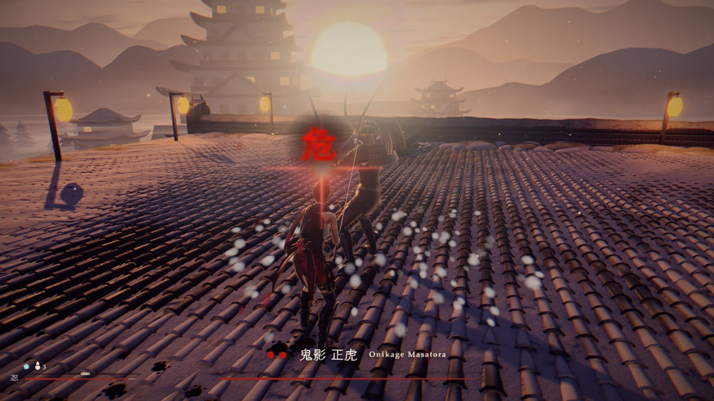
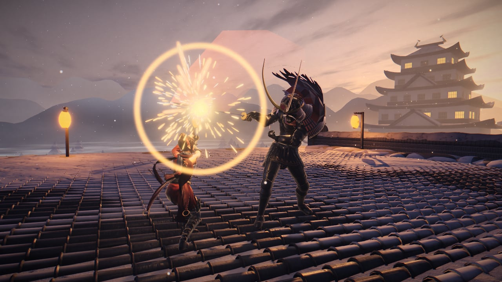
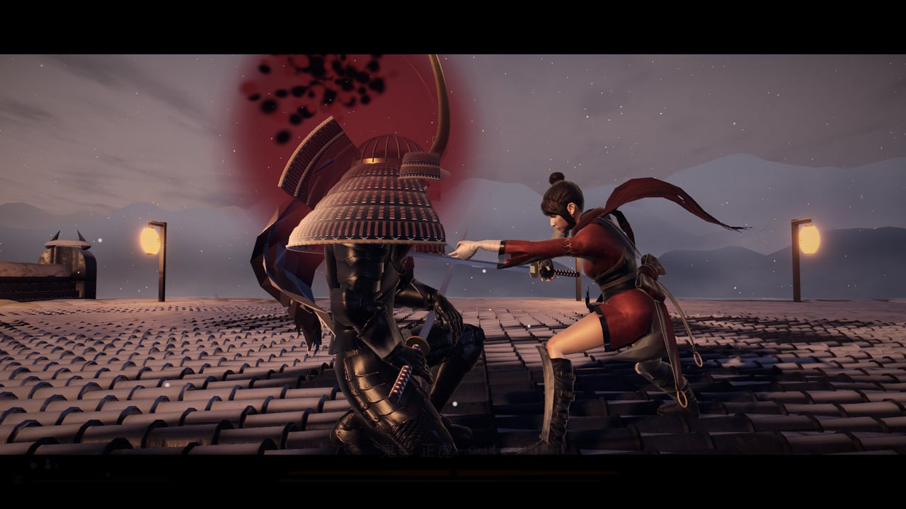

# Shinobi Duel


One sword duel in a browser tab: a kunoichi against a samurai general on a snowy castle rooftop at
dusk, fought the way Sekiro fights. You win by deflecting his blade until his posture breaks, not by
whittling down a health bar, and then you drive the deathblow home. He gets up once, angrier.

**Play it: https://hwkim3330.github.io/shinobi-duel/** — desktop Chrome or Edge, keyboard and
mouse. Pick a side on the title: 忍 the kunoichi against the AI general (the original fight),
将 the general against an AI kunoichi, or 対 an online duel against another player.

> This is a fork of [StarKnightt/shinobi-duel](https://github.com/StarKnightt/shinobi-duel) that
> adds the general as a playable fighter, an AI kunoichi, and online 1v1. See
> [Online and the general](#online-and-the-general). 원작 1인 결투에 장수 조작 모드, AI 쿠노이치,
> 온라인 1대1 대전을 더한 포크입니다.

It was built and measured on an RTX 4060 and wants a desktop GPU. The download is about 22 MB (the
arena is 13 MB of it) and it streams in behind the title screen.

## Running it locally

**pnpm, not npm.** The lockfile is pnpm's.

```bash
git clone https://github.com/StarKnightt/shinobi-duel.git
cd shinobi-duel
pnpm install
pnpm dev        # http://localhost:5411
pnpm build      # strict type-check, then a production build into dist/
pnpm preview    # serve dist/ on http://localhost:5410
```

The build uses a relative base, so `dist/` works from any static host or sub-path; every push to
`main` deploys it to GitHub Pages through `.github/workflows/pages.yml` (built with
`GITHUB_PAGES=1`, which sets the base to `/shinobi-duel/`). `vercel.json` covers Vercel.



## Controls

| Input | Action |
|---|---|
| W A S D | Move, relative to the camera, locked on or free |
| Left mouse (J) | Attack. Hold it and the light cut flows into a charged cut that drives through his guard |
| Right mouse (K, L) | Guard. Tap it just before a blow lands to deflect |
| Shift | Step dodge; hold to sprint. Step into a thrust to mikiri it |
| Space | Jump. Jump again at him to kick off his head; attack in the air for an air cut |
| R | Drink from the healing gourd |
| Middle mouse / Q / Tab | Lock on, or unlock and re-centre the camera behind her |
| M | Mute (remembered) |
| A / D, ← / →, 1 2 3, click | Choose the difficulty on the title: 易 Easy · 中 Medium · 難 Hard (remembered) |
| Enter / E / Space / click | Confirm on the title and end screens; Esc / Backspace goes back |

The title shows the same list in ink. Nothing else is on screen outside the fight HUD.

| URL option | Effect |
|---|---|
| `chars=procedural` | Use the code-built fighters instead of the Mixamo bodies |
| `debug=anim` | In-game clip inspector: scrub clips, see their event bands, copy the events |
| `audio=off` | No sound at all (for A/B performance runs) |
| `difficulty=easy` / `medium` / `hard` | Start on that difficulty (overrides the remembered choice without replacing it) |

## The fight

- **Deflect, posture, deathblow.** A tap of the guard inside 0.25 s of the blow deflects it: sparks,
  a ringing clang and a chunk of his posture, more for each deflect in a chain. Holding the guard
  only blocks, and that wears down your own posture. When his bar fills he staggers and the red
  deathblow mark appears; you have four seconds to take it. Mashing the guard narrows the window
  step by step, so rhythm beats panic.
- **Two phases.** The first deathblow sends him to one knee, and he rises with a battle cry for
  phase two: faster, shorter pauses, new strings (a flurry, leap follow-ups, a combo that ends in a
  grab). The second deathblow is the finisher, played as a letterboxed cinematic.
- **Resurrection.** Die once and you can rise on the spot at half vitality; he keeps the damage you
  did. Die again and it is over.
- **Healing gourd.** Three swallows (four on Easy), 45 % each, not refilled by resurrection. He sees you drink and
  punishes it: point blank at once, from range after a beat.
- **Three perilous attacks.** A red 危 flashes over her head before each. The *thrust* can't be
  guarded; deflect it, sidestep it, or step into it for a **mikiri counter** that stamps his blade
  into the roof. The *sweep* has to be jumped (and a second jump kicks off his head for heavy
  posture). The *grab* can only be dodged or jumped, and leaves him open.
- **Three difficulties.** Picked on the title under the brush lettering. *Medium* is the default
  tuning. *Easy* widens the deflect window to 0.3 s, halves the damage you take, leaves him open
  longer, counters and uses perilous attacks less, breaks faster and gives four swallows. *Hard* is
  the original, pre-easing general: a 0.2 s window, full damage, no free openings, a faster second
  phase. The choice sticks between visits, holds through deaths and restarts, and a faint 易 / 中 /
  難 beside the gourd shows which one you are fighting.
- **Lock-on.** The camera frames both fighters; unlocking re-centres it behind her. The guard turns
  to face him within eight metres either way.
- **Fair, and tested for it.** A simulated "learner" who is 55 ms off on every reaction and misses
  one blow in eight wins on the first or second try, on every difficulty; a masher who spams attack
  and guard loses five times out of five on Medium and Hard (on Easy mashing can get through).



## What is in it

- **Arena built in Blender.** The rooftop, the two keeps, the turrets, the lanterns and the snow
  drifts were modelled in Blender 5.1 through the Blender MCP from Python scripts in
  `tools/blender/`, textured with Poly Haven CC0 scans, ambient occlusion baked in Cycles, and packed
  with glTF-Transform into one 13 MB GLB (WebP textures, meshopt geometry). The sky, mountains, mist
  and sun are shaders in code, lit to a low Sekiro-style dusk: a huge hazy sun behind the general,
  warm rims, cold blue shadows and a painterly grade.
- **Mixamo characters.** The kunoichi is Mixamo's Kachujin and the general is Paladin in a
  procedural horned kabuto, menpō, sode and cape. 85 Mixamo clips were converted headless in
  Blender to two 3 MB GLBs. The combat runs on a hidden procedural reference rig whose timings the
  fight was tuned on; each Mixamo clip is time-warped to land its wind-up, contact and recovery on
  those times, and inside hit windows an IK layer steers the real blade onto the reference blade, so
  sparks sit on both swords.
- **Synthesized audio.** There are no sound files. Every clang, footstep, kiai, gust, temple bell
  and the adaptive taiko and shakuhachi score is generated with the Web Audio API: Karplus-Strong
  shamisen and koto strings, formant voices, a generated rooftop reverb, ducking, and a limiter
  chain so nothing clips however many hits land at once.
- **Ink UI.** The 雪刃 title, the HUD and the end screens are brush lettering drawn in code from
  system fonts (smeared, bristle-streaked, thresholded back into dry-brush ink). No web fonts, no
  image files.



## Online and the general

### Modes

| Title choice | You | Against |
|---|---|---|
| 忍 Kunoichi vs AI | the kunoichi (keyboard + mouse) | the AI general: the original game, unchanged |
| 将 General vs AI | the general | an AI kunoichi that deflects, mikiris, jumps sweeps and kicks off your head; Easy / Medium / Hard set its reaction error and how many blows it misses (the rules stay on Medium) |
| 対 Online duel | the side you pick (the room's host decides) | another player: one kunoichi, one general |

Online: **Create room** gives a five-letter code and a link to send; **Join** takes a code;
**Quick match** pairs you with the next player waiting. After the fight both press Enter for a
rematch, Esc leaves.

### The general's controls

| Input | Action |
|---|---|
| W A S D | Move (camera-relative; he always turns to face her) |
| Left mouse / J | Three-cut string |
| F | Overhead |
| C | Delayed string (the third blow hangs to catch early deflects) |
| Right mouse / K | Guard; tap it as her cut lands to deflect it (her rule and her anti-mash) |
| Q · E · R | 危 Perilous thrust · sweep · grab (shared cooldown; grab from his second life) |
| X | Flurry (second life) |
| Space | Leap in (from 2.8 m, cooldown) |
| Shift | Step (i-frames); hold to run |
| Tab | Lock on / free camera |

Everything an attack does once it starts (its timings, lunges, glints, openings, what a deflect or
a mikiri does to him) is the same data the AI general fights with. Strings follow only where the
AI's do: press the next attack at the end of one (leap → thrust or sweep; in the second life
flurry → thrust, string → grab, delayed string → sweep). He stays open after every attack, a guard
that isn't raised is cut clean, and the move panel bottom-right shows which perilous attacks are
ready.

### How the netcode works

The fight was already deterministic (a fixed 120 Hz step and seeded randomness, for the test
harness), so online play is **deterministic lockstep**: the two browsers send each other nothing
but input frames and each runs the whole duel itself. A frame sampled at tick *t* is played at
tick *t + delay*, where the delay is picked from the measured round trip before the fight (3 ticks,
25 ms, on a LAN), so on a normal connection neither side waits. Details:

- **Transport.** The server only introduces the two players (room codes, quick match) and passes
  the WebRTC handshake. The duel then runs over two DataChannels straight between them: inputs on
  an unordered no-retransmit channel, with every packet carrying all frames not yet acknowledged,
  and control messages on a reliable one. If no direct link can be opened (no TURN server is used)
  the same traffic goes through the server's WebSocket relay instead.
- **Same start.** An online page never runs the title simulation: the sim stays frozen from page
  load until START, so both machines begin from the state the page was built in, however long
  each one sat in the lobby. Rematches start from states that are already identical.
- **Checked.** Every second both sides hash the fight state and compare. On a mismatch (a
  browser engine whose `Math` differs, say) the host names a tick the guest can't have reached
  yet, and the guest waits there for the host's gameplay state. Two Chrome instances have never
  needed one in testing; an injected corruption is repaired by a single resync.
- **Builds.** Players are only paired with the same build (the git commit), since lockstep needs
  identical code on both ends.

`tools/netplay.mjs` runs two real browsers through the lobby server (the kunoichi's side runs the
deflect bot through its keyboard controller, the general's side mashes his moveset) and prints
both machines' view every 5 s. `NET_EXTRA="&p2p=0&lag=60"` forces the relay and adds 60 ms each
way; `NET_DESYNC=1` corrupts the guest's copy once to exercise the resync. `tools/general.mjs`
plays a scripted general against the AI kunoichi with real key events.

### Running it online yourself

```bash
pnpm build
node server/server.mjs          # serves dist/ and the lobby on http://localhost:7860
node tools/netplay.mjs 60       # two browsers, one duel
tools/deploy-hf.sh              # the same thing as a Docker Hugging Face Space
```

The dev server (`pnpm dev`, port 5411) looks for the lobby on `ws://localhost:7860/ws`;
`?signal=wss://host/ws` points any build at another lobby. A build with no lobby of its own
(GitHub Pages) meets through the public [PeerJS](https://peerjs.com) broker instead
(`src/net/PeerTransport.ts`, or `?signal=peerjs` anywhere): same rooms and quick match, but no
relay, so two networks that block every direct link can't duel that way. `tools/deploy-hf.sh`
needs a Hugging Face PRO account (Docker Spaces aren't free on cpu-basic).

## Tools

Every tool drives the real game in a GPU-backed headless Chromium (`tools/gpu.mjs` refuses to run on
a software rasterizer). They need `pnpm dev` running (port 5411); `DUEL_URL` points them at any
other build, e.g. `DUEL_URL=http://localhost:5410/ node tools/bot.mjs`, and `DUEL_VIEW=960x540`
shrinks the viewport.

| Tool | What it checks |
|---|---|
| `node tools/bot.mjs` | Real-time playtest: title, a key, both phases. Passes only with ≥6 deflects, a mikiri, a jumped sweep, exactly one heal, two deathblows, VICTORY and zero errors |
| `node tools/mech.mjs` | 51 deterministic mechanics checks: input, movement, camera, the deflect window and anti-mash, mikiri, sweep and kick, grab, gourd and punish, deathblows, regen tables, cancels, death flow |
| `node tools/combat.mjs` | 19 sword-fight glitch repros, one per bug fixed in the combat pass (floating sparks, blades through bodies, lunges overshooting…) |
| `node tools/deathloop.mjs` | Real keyboard and mouse events through three rounds of die, resurrect, die, defeat and restart |
| `node tools/fairness.mjs` | Simulated players: a frame-perfect bot, a learner, a casual player and a masher (add `?difficulty=` to `DUEL_URL` for the other presets) |
| `node tools/difficulty.mjs` | The title's difficulty choice with real keys and clicks: never starts the fight, remembered, kept through three rounds of die, resurrect, defeat and restart |
| `node tools/soak.mjs [secs]` | Five bot fights back to back, random-input fuzz, resource growth, hitches, tab switches, resizes |
| `node tools/perf.mjs` | Frame rate and first-use shader compiles |
| `node tools/shoot.mjs`, `tools/og.mjs` | Screenshots of named set pieces; `og.mjs` renders the images in this README |
| `node tools/audio-render.mjs` | Renders ~50 sounds offline through the real mix; fails on clipping, NaN or silence |

`window.__duel` exposes the hooks they use: `game` (pause, step, startFight, forceBossAttack,
place…), `rules` (the tuned constants), `setDifficulty('easy' | 'medium' | 'hard')` (applies from
the next fight) and `scene(name)` for deterministic set pieces.

## Performance

200 fps (the headless cap) at 1600×900 on an RTX 4060, with the Mixamo bodies, full post chain
(N8AO, bloom, god rays, grade), 4096² sun shadows and 13 lantern lights; 92-98 fps at 2560×1440.
`bot.mjs` fights hold 144-200 fps, and the 120-second soak has no combat frame over 20 ms. Every
shader, the hidden combat effects included, is compiled behind the title so the first deflect
never stalls. The production build reaches `__duel.ready` in about 7 s from a local server.



## Layout

```
src/
  game/     Game (state, rules, events), Player, Boss, CameraRig, difficulty knobs
  chars/    procedural rigs, SkinnedCharacter (Mixamo time-warp + blade IK), cloth, clip events
  world/    Arena (GLB, lights, lanterns), Surround (sky, mountains, mist), materials
  render/   post chain: N8AO, bloom, god rays, custom grade
  fx/       sparks, trails, snow, particles
  audio/    synthesis, mix, voices, music, ambience
  ui/       brush lettering and the HUD
  core/     input, fixed-step loop, math
  debug/    ?debug=anim clip inspector
public/assets/   arena.glb, sky_dusk.hdr, chars/player.glb, chars/boss.glb
blender/arena.blend   arena source (textures are fetched by tools/blender)
tools/      headless test and capture harness; tools/blender/ is the asset pipeline
```

## Stack

Three.js 0.186 · TypeScript · Vite · pmndrs `postprocessing` and N8AO for the post chain · Web
Audio · Blender 5.1 and glTF-Transform for the assets · Playwright for the test and capture harness
· GitHub Pages.

## Credits and licences

The code is MIT (see below). Third-party assets keep their own licences:

- **Characters and animations: [Adobe Mixamo](https://www.mixamo.com).** Kachujin G Rosales and
  Paladin J Nordstrom, with 85 animation clips (listed with product ids in
  [`assets/mixamo/MANIFEST.md`](assets/mixamo/MANIFEST.md)). Used under Adobe's Mixamo terms, which
  allow them in games; they are shipped only embedded in the game's converted GLBs. The raw Mixamo
  files are not in this repository, because the terms forbid redistributing them on their own.
- **Textures and sky: [Poly Haven](https://polyhaven.com), [CC0](https://polyhaven.com/license).**
  [Roof Tiles](https://polyhaven.com/a/roof_tiles),
  [Japanese Stone Wall](https://polyhaven.com/a/japanese_stone_wall),
  [Plastered Wall 02](https://polyhaven.com/a/plastered_wall_02),
  [Weathered Planks](https://polyhaven.com/a/weathered_planks),
  [Snow 02](https://polyhaven.com/a/snow_02) and the HDRI
  [Qwantani Dusk 2 (Pure Sky)](https://polyhaven.com/a/qwantani_dusk_2_puresky).
- **[Three.js](https://threejs.org)** (MIT), **[pmndrs postprocessing](https://github.com/pmndrs/postprocessing)**
  (Zlib) and **[N8AO](https://github.com/N8python/n8ao)** (ISC).
- Everything else, the audio, the UI lettering, the sky and the general's armour, is generated in
  code in this repository.

**Inspired by *Sekiro: Shadows Die Twice*.** Shinobi Duel is a fan-made homage to its combat. The
characters, names, story, art, sound and UI are original. It is not affiliated with, endorsed by or
connected to FromSoftware or Activision, and uses none of their assets.

## Licence

MIT. See [LICENSE](LICENSE). The Mixamo and Poly Haven assets are under their own terms, above.
